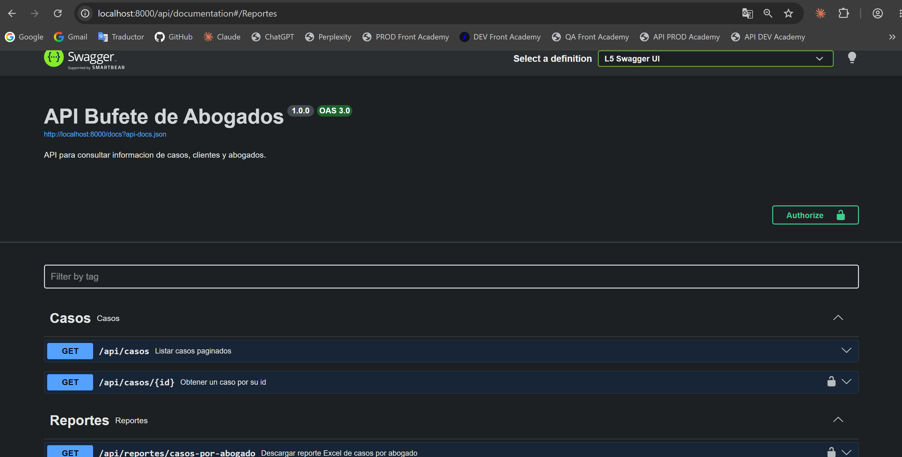
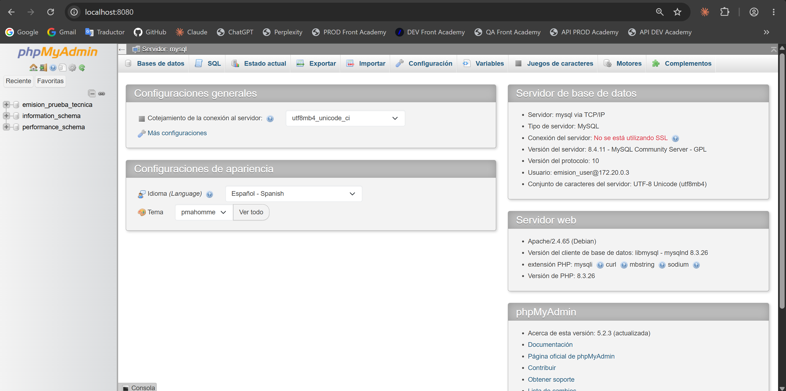
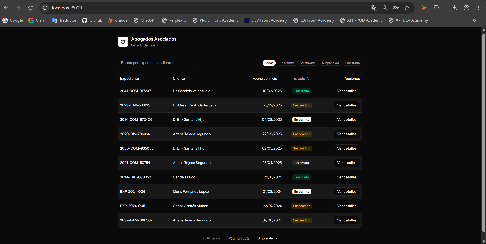
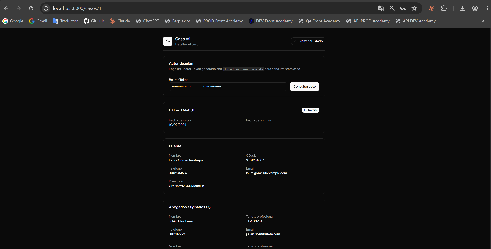

# Prueba técnica Emisión - Desarrollador de Software Mid
### Julian Andres Montoya Carvajal

## Instrucciones etapa de desarrollo

1) Preferiblemente trabajar en Ubuntu 22.04 LTS (puede utilizar WSL2 en
   Windows para instalar Ubuntu)
2) Tener instalado Docker y Docker Compose para la orquestación de los
   servicios: https://www.digitalocean.com/community/tutorials/how-to-install-and-use-docker-on-ubuntu-22-04
3) Clone el repositorio con el siguiente comando:
   ```bash
   git clone https://github.com/andresprogramacion123/Prueba-tecnica-emision.git
   ```
4) Ingrese a la carpeta del proyecto:
   ```bash
   cd Prueba-tecnica-emision
   ```
5) Cree el archivo de variables de entorno `.env` en la raíz del proyecto a
   partir del `.env.example` incluido:
   ```bash
   cp .env.example .env
   ```
   El `.env.example` trae `DB_CONNECTION=sqlite` por defecto y las variables
   de MySQL comentadas. Antes de levantar Docker, edite el `.env` y
   ajuste/agregue las siguientes variables para que coincidan con lo que
   espera `docker-compose.yml`:
   ```env
   DB_CONNECTION=mysql
   DB_HOST=mysql
   DB_PORT=3306
   DB_DATABASE=emision
   DB_USERNAME=emision_user
   DB_PASSWORD=secret
   DB_ROOT_PASSWORD=root_secret
   ```
   - `DB_HOST` debe ser `mysql` (nombre del servicio en `docker-compose.yml`,
     no `127.0.0.1`).
   - `DB_DATABASE`, `DB_USERNAME` y `DB_PASSWORD` los usan tanto Laravel como
     el contenedor `mysql` y `phpmyadmin` para crear la base de datos y el
     usuario.
   - `DB_ROOT_PASSWORD` es exclusivo del contenedor `mysql` (usuario `root`,
     usado también en su healthcheck) y no viene en el `.env.example`, debe
     agregarse manualmente.

## Levantar los servicios con Docker

El proyecto se levanta con Docker Compose, que orquesta 4 servicios: la
aplicación Laravel (PHP-FPM), Nginx, MySQL y phpMyAdmin.

```bash
sudo docker compose up -d --build
```

Al iniciar, el contenedor `app` espera a que MySQL esté disponible, genera la
`APP_KEY` si hace falta, corre las migraciones (`php artisan migrate --force`)
y cachea configuración y rutas automáticamente.

Las imágenes de `app` y `nginx` son autocontenidas: no montan el código del
host, todo (`vendor/`, los assets de Vite compilados, etc.) queda incluido en
la imagen durante el build multi-stage. Esto significa que **un cambio de
código no se refleja hasta reconstruir la imagen** (`sudo docker compose up
-d --build`); no hay recarga en caliente con este `docker-compose.yml`, que
está pensado para representar el entorno que correría un evaluador, no para
desarrollo iterativo del día a día.

La única excepción es el archivo `.env`: se monta como bind mount de un solo
archivo (`./.env:/var/www/html/.env`), no todo el código. Esto es
intencional y necesario, no un descuido: `.env` no puede ir horneado en la
imagen (son credenciales locales, y ni siquiera existe hasta que el usuario
lo crea en el paso anterior), y `php artisan key:generate` necesita un
archivo físico real para poder escribir la `APP_KEY` generada. Al montarlo
desde el host, esa key se persiste ahí y sobrevive a reinicios y rebuilds del
contenedor, en vez de regenerarse (y invalidar sesiones/cookies cifradas) en
cada arranque.

### Comandos de limpieza

Si algo falla o se quiere reiniciar todo desde cero:

```bash
sudo docker compose down
```
Detiene y elimina los contenedores (mantiene los volúmenes, es decir, los
datos de la base de datos).

```bash
sudo docker compose down -v
```
Igual al anterior, pero además borra los volúmenes (se pierden los datos de
la base de datos).

```bash
sudo docker compose down --rmi all
```
Borra también las imágenes construidas por el proyecto.

```bash
sudo docker builder prune -a -f
```
Limpia la caché de build de Docker.

## Enlaces disponibles

Con los servicios levantados:

- Aplicación web (frontend): http://localhost:8000
- Documentación Swagger de la API: http://localhost:8000/api/documentation
- phpMyAdmin: http://localhost:8080

### Documentación Swagger



### phpMyAdmin



### Vista principal de casos



### Detalle de un caso



## Funcionalidades del listado de casos

La vista principal (`/`) permite explorar los casos de forma interactiva,
sin necesidad de recargar la página (usa Inertia con `preserveState` para
mantener el estado de filtros al paginar):

- **Búsqueda**: un campo de texto filtra por número de expediente o nombre
  del cliente (coincidencia parcial, sin distinguir mayúsculas/minúsculas),
  con debounce de 350ms para no disparar una petición por cada tecla.
- **Filtro por estado**: chips para filtrar por `En trámite`, `Archivado`,
  `Suspendido` o `Finalizado`, con los mismos colores que los badges de la
  tabla.
- **Ordenamiento**: las columnas "Fecha de inicio" y "Estado" son clickeables
  para ordenar ascendente/descendente.
- Todos los filtros (búsqueda, estado, orden) se combinan entre sí y se
  conservan al cambiar de página, y quedan reflejados en la URL (compartible
  por link).

Estos mismos filtros están disponibles también desde la API pública
(`GET /api/casos`) vía query params: `search`, `estado`, `sort_by`
(`fecha_inicio` o `estado`) y `sort_dir` (`asc` o `desc`), además de `page`
y `per_page` para la paginación.

## Comandos importantes

Generar datos de prueba (seed) - crea un usuario, clientes, abogados y casos
de ejemplo:
```bash
sudo docker compose exec app php artisan db:seed
```

Generar un Bearer Token de prueba (Sanctum) para un usuario, creándolo si no
existe - lo necesitará para consultar el detalle de un caso:
```bash
sudo docker compose exec app php artisan token:generate tu@email.com
```

Generar el reporte Excel de casos por abogado por línea de comando (una hoja
por abogado activo), persistiendo una copia en `storage/app/reportes/`
**dentro del contenedor** (no hay bind mount hacia el host, así que el
archivo no aparece en el `storage/app/reportes/` local; se pierde si el
contenedor se recrea o se reconstruye la imagen):
```bash
sudo docker compose exec app php artisan reporte:excel-abogados
```
Para copiarlo al host:
```bash
sudo docker compose cp app:/var/www/html/storage/app/reportes ./storage/app/reportes
```

## Estructura de proyecto

```
.
├── docker-compose.yml
├── docker/
│   ├── php/
│   │   └── Dockerfile
│   ├── entrypoint.sh
│   └── nginx/
│       └── default.conf
├── app/
│   ├── Models/
│   │   ├── Cliente.php
│   │   ├── Abogado.php
│   │   ├── Caso.php
│   │   └── User.php
│   ├── Http/Controllers/
│   │   ├── Api/
│   │   │   ├── CasoController.php
│   │   │   └── ReporteController.php
│   │   └── CasoWebController.php
│   ├── Exports/
│   │   ├── ReporteCasosPorAbogadoExport.php
│   │   └── CasosPorAbogadoSheetExport.php
│   ├── Console/Commands/
│   │   ├── GenerateApiToken.php
│   │   └── ReporteExcelAbogados.php
│   ├── Services/
│   │   ├── CasoListingService.php
│   │   └── ReporteCasosPorAbogadoService.php
│   └── Enums/
│       └── EstadoCaso.php
├── database/
│   ├── migrations/
│   ├── seeders/
│   │   └── DatabaseSeeder.php
│   ├── factories/
│   └── sql/
│       ├── schema.sql       # Esquema de la base de datos (punto 1)
│       ├── datos.sql        # Datos de prueba (punto 1)
│       └── consultas.sql    # Consultas SQL pedidas (punto 1)
├── routes/
│   ├── api.php
│   └── web.php
├── resources/js/
│   ├── pages/casos/
│   │   ├── index.tsx        # Listado de casos (vista pública)
│   │   └── show.tsx         # Detalle de un caso
│   └── lib/
├── storage/app/reportes/    # Excel generados por el comando artisan
└── tests/Feature/
```

El backend usa **Laravel 13** (`laravel/framework: ^13.17`) con la
arquitectura MVC estándar del framework y Eloquent como ORM.

El frontend usa **React 19** con TypeScript sobre **Inertia.js v3**
(`@inertiajs/react: ^3.0.0`). Inertia permite que las páginas React en
`resources/js/pages` sean renderizadas directamente por rutas y controladores
Laravel, sin necesidad de construir una API REST separada para servir el
frontend.

Los tres archivos pedidos en el punto 1 de la prueba (esquema, datos de
prueba y consultas SQL) están en `database/sql/`: `schema.sql` define las
tablas, `datos.sql` las puebla con datos de ejemplo y `consultas.sql` contiene
las consultas solicitadas.

Los reportes Excel se generan a partir de `ReporteCasosPorAbogadoExport` (una
hoja por abogado, vía `CasosPorAbogadoSheetExport`). El comando artisan
`reporte:excel-abogados` los persiste en `storage/app/reportes/`; el endpoint
de la API (`GET /api/reportes/casos-por-abogado`) los genera al vuelo y los
descarga sin guardarlos en disco.

## Decisiones de diseño

- El listado de casos (`GET /api/casos` y la vista web `/`) es público.
- El detalle de un caso (`GET /api/casos/{id}`) requiere Bearer Token vía
  Sanctum. Como no hay sistema de login para este flujo, el token se genera
  con el comando artisan `token:generate` y se pega manualmente en la vista
  de detalle del frontend.
- Se usa `softDeletes()` en las tablas de negocio (`clientes`, `abogados`,
  `casos`) en vez de `DELETE` físico, cumpliendo el requisito de no eliminar
  registros.
- El endpoint de descarga de reporte Excel (`GET /api/reportes/casos-por-abogado`)
  genera el archivo en memoria y lo descarga sin persistirlo en disco, para no
  acumular archivos en cada descarga. El comando artisan `reporte:excel-abogados`
  sí persiste una copia en `storage/app/reportes/`.

## Cómo correr los tests

```bash
sudo docker compose exec app php artisan test
```

## Posibles mejoras futuras

Esta prueba técnica se enfocó en los requisitos puntuales solicitados. En una
versión productiva de este sistema, las siguientes mejoras serían el
siguiente paso natural:

**Autenticación y control de acceso**
- Pantalla de inicio de sesión (usuario/correo + contraseña) en vez del flujo
  actual de pegar un Bearer Token manualmente, con manejo de sesión real
  para el frontend.
- Roles y permisos (ej. administrador, abogado, asistente) para diferenciar
  quién puede ver, crear o editar según su rol.

**Gestión completa (CRUD)**
- Formulario de creación y edición de casos, incluyendo asignar o
  desasignar abogados a un caso existente.
- Formulario de creación y edición de abogados y clientes.
- Vista de listado de abogados (con sus casos asociados) y de clientes,
  análoga a la de casos.
- Confirmación explícita para archivar/dar de baja un registro (soft delete
  desde la UI), ya que hoy solo existe a nivel de base de datos.

**Calidad de vida y observabilidad**
- Historial de cambios por caso (auditoría: quién y cuándo modificó qué).
- Notificaciones (por correo o en la app) cuando se asigna un caso a un
  abogado, o cuando un caso cambia de estado.
- Dashboard con métricas básicas (casos por estado, carga de trabajo por
  abogado, casos próximos a vencer).
- Manejo de refresh tokens y expiración configurable para los Bearer Tokens,
  en vez de tokens sin vencimiento.
- Registro y monitoreo de errores en producción (ej. Sentry) y logging
  estructurado.

**Calidad de código y despliegue**
- Pipeline de CI/CD (tests automáticos y build de la imagen Docker en cada
  push).
- Tests end-to-end del frontend (ej. Playwright) además de los tests de
  backend ya existentes.
- Rate limiting en los endpoints públicos de la API.